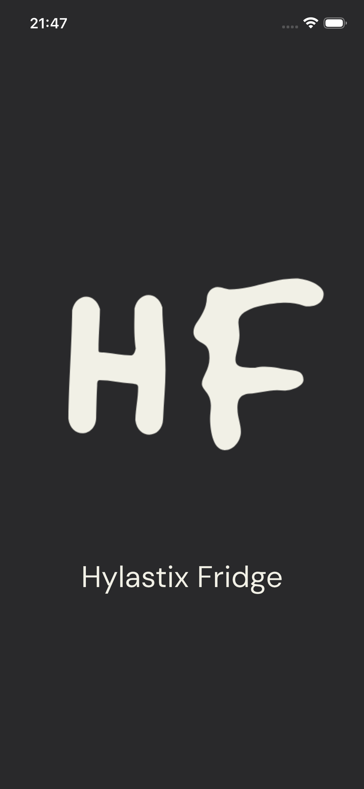
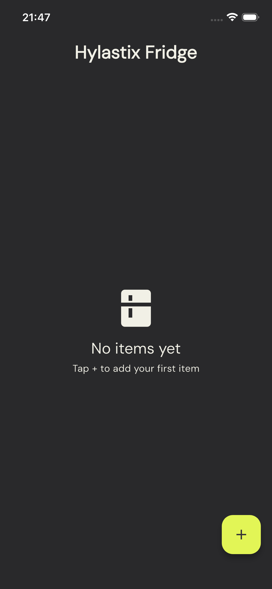
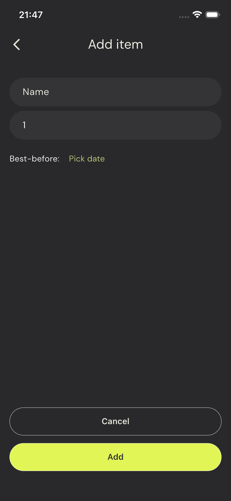
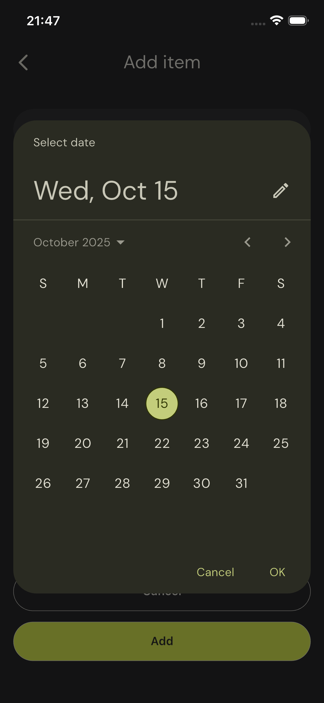
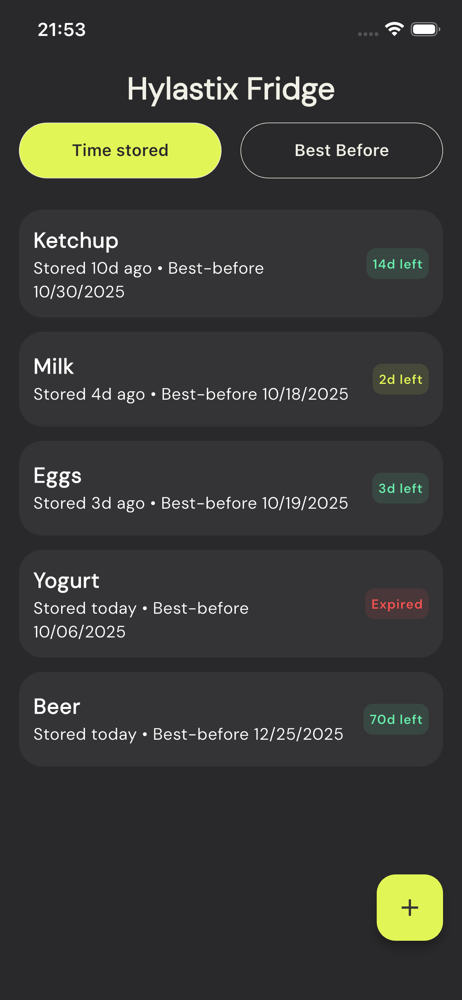
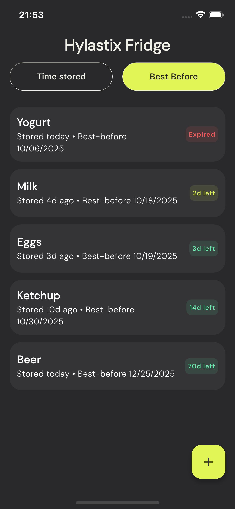

# Fridge Tracker – Take-Home Assignment • Nikola Jočić

This Flutter application was built as part of a take-home assignment.  
It allows users to  track food items stored in a refrigerator, sorted by time stored or best-before date.  
The focus of this project was on  clean UI/UX, clear architecture, and a review-friendly local setup using the Firebase Emulator Suite.

----------

<table border="0" style="border:none;"> <tr> <td valign="top" width="60%">

### Contents

-   [Features](#features)

-   [Architecture](#architecture)

-   [Setup Database](#setup-database)

-   [Design Decisions](#design-decisions)

-   [Error Handling](#error-handling)

-   [Future Improvements](#future-improvements)

-   [App Screenshots](#app-screenshots)

</td> <td align="center" width="20%">  </td> </tr> </table>

----------

## Features

-   CRUD operations for fridge items  
    _(Create, Read, Update, Delete)_

-   Sorting by

    -   **Time stored**  (oldest first)

    -   **Best-before date**  (soonest first)

-   Color indicators for item freshness

    -   Red → expired

    -   Orange → expires soon

    -   Green → still fresh

-   Lightweight add/edit form using modal bottom sheets

-   Works entirely offline or with Firebase Emulator (no login required)

-   Optional integration with  **Firestore**  or a  **local data source**

----------

## Architecture

-   **Flutter + Firebase**

-   **Minimal state management**  — relies on  `setState`  and clean separation of UI components

----------

## Setup Database

1.  Install Firebase CLI

    `npm install -g firebase-tools`

2.  Initialize Firebase in your project directory

    `firebase init`

    -   Choose  **Don’t set up a default project**

    -   For features, choose only  **Firestore Emulator**

3.  Configure emulators

    `Which Firebase emulators do you want to  set up?
    → [✔] Firestore Emulator

    Which port do you want to use for the firestore emulator? **8080**
    Would you like  to  enable the Emulator UI? **Yes**
    Which port do you want to use for the Emulator UI? **(leave empty)**
    Would you like  to download the emulators now? **Yes**`

4.  Start the emulator

    `firebase emulators:start --project demo-project-id`

----------

----------

## Design Decisions

-   **One-screen UI**  — simplifies navigation and highlights CRUD flow.

-   **Modal bottom sheet forms**  instead of navigation routes.

-   **Backend abstraction**  via  `FridgeItemsDataSource` using `FridgeItemsFirestore`  (emulator)

-   **Null-safety + simple model mapping**  (`toMap()`  /  `fromMap()`).

-   **Simple color-coded feedback**  for item freshness.

----------

## Error Handling

-   **Form validation**  — required name, positive quantity, valid date range.

-   **Backend safety**:

    -   Wrap Firestore calls in  `try/catch (FirebaseException)`.

-   **SnackBars**  for UI feedback on errors and retries.

-   **Result<T> pattern**  used for consistent error reporting across data sources.

----------

## Future Improvements

-   Add image picker for item photos

-   Add authentication (per-user fridge)

-   Push notifications for items nearing expiry

-   Filter and search

-   Persist local data via Hive or SQLite

-   Offline sync for Firestore

----------

## App Screenshots

     
     
     

     
     
     

